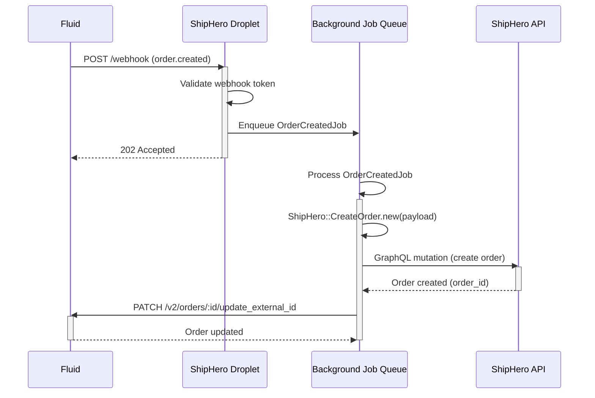
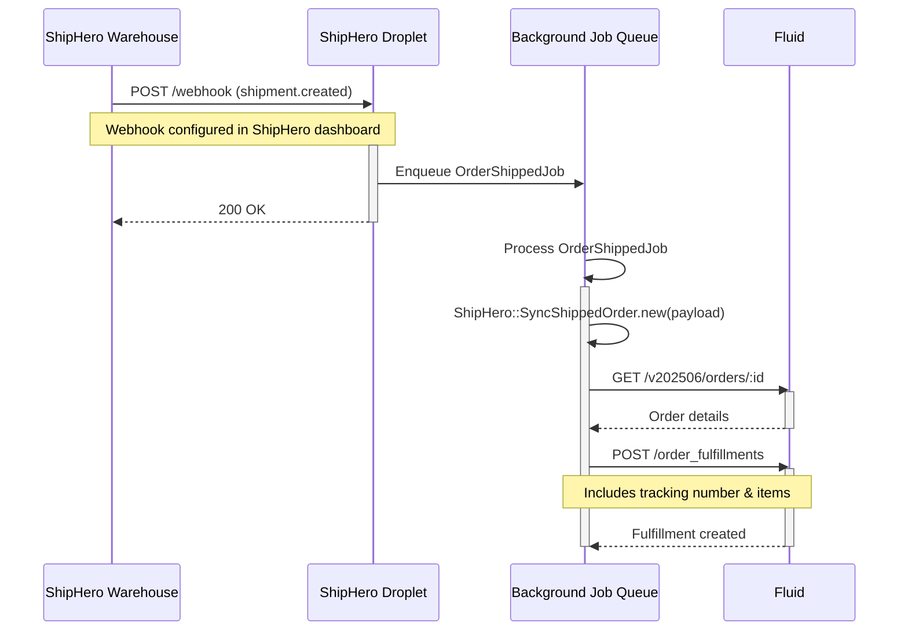

## README

ShipHero Droplet - Integration between ShipHero fulfillment service and Fluid Commerce.

This droplet enables bidirectional order fulfillment:
- **Fluid → ShipHero**: Creates orders in ShipHero when orders are placed in Fluid
- **ShipHero → Fluid**: Updates order status with tracking information when shipments are processed

Documentation can be found in the [project's GitHub page](https://fluid-commerce.github.io/droplet-template/)

## Architecture

### Order Creation Flow (Fluid → ShipHero)



### Order Fulfillment Flow (ShipHero → Fluid)



## Configuration Requirements

### ShipHero Credentials
- ShipHero API Username
- ShipHero API Password
- Store Name (for ShipHero)
- Warehouse Name

### Fluid API
- Fluid API Token (for updating order status back to Fluid)

These are configured through the droplet UI after installation.

### Webhook Configuration

After setting up ShipHero credentials, you need to register webhooks in ShipHero:

```bash
# Check webhook status
rake shiphero:webhooks:check[COMPANY_ID]

# Setup webhooks automatically
rake shiphero:webhooks:setup[COMPANY_ID]

# List all webhooks
rake shiphero:webhooks:list[COMPANY_ID]
```

**Documentation:**
- [Webhook Quick Start](./docs/WEBHOOK_QUICK_START.md) - Get started in 3 commands
- [Complete Webhook Guide](./docs/SHIPHERO_WEBHOOK_GUIDE.md) - Full reference with security & troubleshooting

## Production environment

### Google cloud infrastructure

- Google Cloud Run (Web)
- Google Cloud Storage (Terraform)
- Google Cloud SQL (postgreSQL)
- Google Cloud Build (CI/CD)
- Google Cloud Compute Engine (jobs console)
- Artifact Registry (Docker)

web: Google Cloud Run name `fluid-droplet-shiphero`

migration: Google Cloud Run Job name `fluid-droplet-shiphero-migrations`

jobs console: Google Cloud Compute Engine name `fluid-droplet-shiphero-jobs-console`

### Deploy to google cloud

Run github action to deploy to google cloud `deploy production`
or run the following command to deploy to google cloud  

`gcloud beta builds submit --config cloudbuild-production.yml --region=europe-west1 --substitutions=COMMIT_SHA=$(git rev-parse --short HEAD),_TIMESTAMP=$(date +%Y%m%d%H%M%S) --project=fluid-417204 .`

### Add environment variables to google cloud

Add environment variables to google cloud `add-update-env-gcloud.sh` and run the following command to add environment variables to google cloud
`sh add-update-env-gcloud.sh`

### Running a rails console on google cloud
1 - Access ssh from compute engine `fluid-droplet-shiphero-jobs-console`
2 - Run `docker exec -it $(docker ps -q | head -n 1) bin/rails c`
#### Check logs
Run `docker logs -it $(docker ps -q | head -n 1)`

### Technology Stack


<br>

## Local environment

### Setup

1. Install dependencies:
   ```bash
   bundle install
   yarn install
   gem install foreman
   ```

2. Setup database:
   ```bash
   bin/rails db:create db:migrate
   ```

3. Create default settings and test data (optional):
   ```bash
   bin/rails db:seed
   ```

### Running locally

Just the rails server (port 3000):
```bash
foreman start -f Procfile.dev
```

Running everything (port 3200):
```bash
bin/dev
```

### Running locally with docker

Configure your environment variables in `.env` file
and run the following command:  
`make install`
Running it as a docker service (port 3600)<br>
`make up`

Run `make help` to see all commands

### License

MIT License

Copyright (c) 2025 Fluid Commerce

Permission is hereby granted, free of charge, to any person obtaining a copy
of this software and associated documentation files (the "Software"), to deal
in the Software without restriction, including without limitation the rights
to use, copy, modify, merge, publish, distribute, sublicense, and/or sell
copies of the Software, and to permit persons to whom the Software is
furnished to do so, subject to the following conditions:

The above copyright notice and this permission notice shall be included in all
copies or substantial portions of the Software.

THE SOFTWARE IS PROVIDED "AS IS", WITHOUT WARRANTY OF ANY KIND, EXPRESS OR
IMPLIED, INCLUDING BUT NOT LIMITED TO THE WARRANTIES OF MERCHANTABILITY,
FITNESS FOR A PARTICULAR PURPOSE AND NONINFRINGEMENT. IN NO EVENT SHALL THE
AUTHORS OR COPYRIGHT HOLDERS BE LIABLE FOR ANY CLAIM, DAMAGES OR OTHER
LIABILITY, WHETHER IN AN ACTION OF CONTRACT, TORT OR OTHERWISE, ARISING FROM,
OUT OF OR IN CONNECTION WITH THE SOFTWARE OR THE USE OR OTHER DEALINGS IN THE
SOFTWARE.
