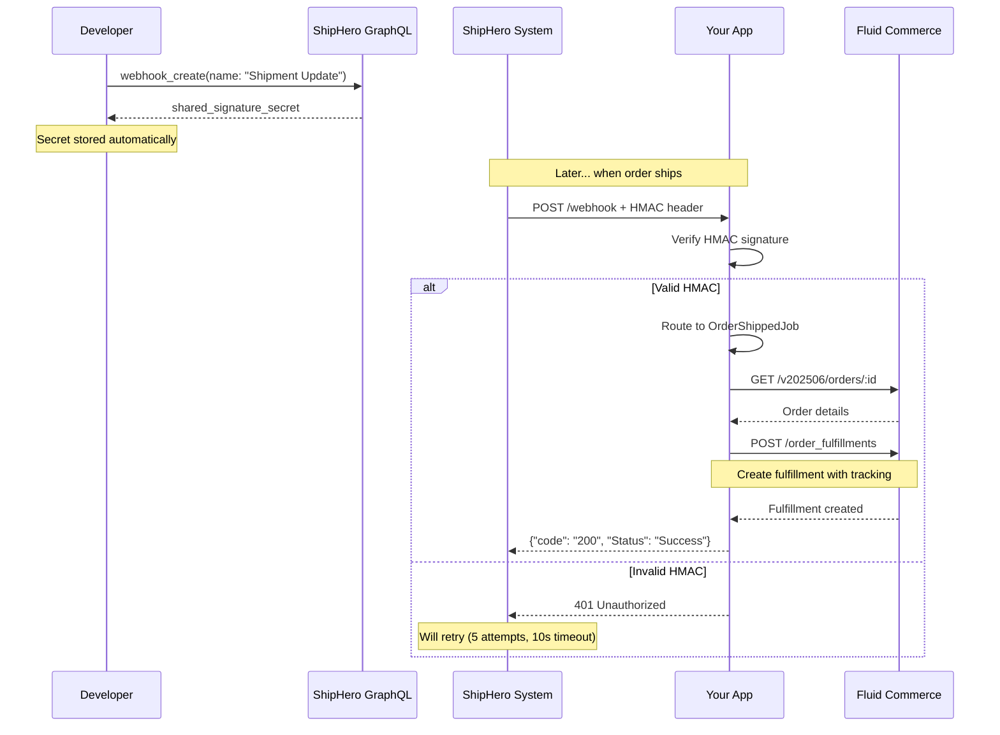

# ShipHero Webhook Integration - Complete Guide

## Quick Links
- [Quick Start Commands](#quick-start) - Get started in 3 commands
- [GraphQL API Reference](#graphql-api-reference) - Mutations and queries
- [Security & HMAC Verification](#security-hmac-verification) - Required security implementation
- [Troubleshooting](#troubleshooting) - Common issues and solutions

---

## Overview

ShipHero webhooks enable real-time notifications about order shipments, inventory changes, and other events. This guide covers everything you need to set up and secure webhooks for your ShipHero integration.

### Available Webhook Types (17 Total)

Use these **exact names** when creating webhooks:

1. ✅ **"Shipment Update"** - Order fulfillment (IMPLEMENTED)
2. "Inventory Update" - Stock level changes
3. "Inventory Change" - Inventory transactions  
4. "Automation Rules" - Automation triggers
5. "Order Canceled" - Order cancellations
6. "Capture Payment" - Payment captures
7. "PO Update" - Purchase order updates
8. "Return Update" - Return processing
9. "Tote Complete" - Tote completion
10. "Tote Cleared" - Tote clearing
11. "Order Packed Out" - Packing completion
12. "Package Added" - Package additions
13. "Print Barcode" - Barcode printing
14. "Order Allocated" - Order allocation
15. "Order Deallocated" - Order deallocation
16. "Shipment ASN" - Advanced ship notices
17. "Generate Label" - Label generation (20s timeout)

---

## Quick Start

### Prerequisites
- Company configured with ShipHero credentials
- Access to Rails console or rake tasks

### Find Your Company ID
```bash
rails console
Company.all.pluck(:id, :name, :fluid_company_id)
# Output: [[1, "My Company", 12345]]
#          ↑ This is your Company ID
```

### Setup Webhook (3 Commands)
```bash
# 1. Test connection
rake shiphero:test_connection[1]

# 2. Check webhook status  
rake shiphero:webhooks:check[1]

# 3. Create webhook
rake shiphero:webhooks:setup[1]
```

**Done!** Your webhook is now registered and secured. 🎉

---

## GraphQL API Reference

### Create Webhook

```graphql
mutation {
  webhook_create(data: {
    name: "Shipment Update"           # ← Webhook type selector!
    url: "https://your-url.com/webhook"
    shop_name: "fluid-droplet"        # ← Identifier (allows multiple webhooks)
  }) {
    request_id
    complexity
    webhook {
      id
      legacy_id
      account_id
      shop_name
      name
      url
      source
      shared_signature_secret         # ← CRITICAL: Only shown once!
    }
  }
}
```

**Important Fields:**
- **`name`**: Exact webhook type from the list above (e.g., "Shipment Update")
- **`url`**: Your webhook endpoint URL
- **`shop_name`**: Identifier allowing multiple webhooks of same type
- **`shared_signature_secret`**: Used for HMAC verification - **only shown once!**

### List Webhooks

```graphql
query {
  webhooks {
    request_id
    complexity
    data {
      edges {
        node {
          id
          legacy_id
          account_id
          shop_name
          name
          url
          source
        }
      }
    }
  }
}
```

### Delete Webhook

```graphql
mutation {
  webhook_delete(data: { 
    name: "Shipment Update"
    shop_name: "fluid-droplet"
  }) {
    request_id
    complexity
  }
}
```

**Note:** Webhooks are deleted by `name` + `shop_name`, not by ID.

---

## Security: HMAC Verification 🔒

### Why HMAC Verification is Required

Every webhook from ShipHero includes an `x-shiphero-hmac-sha256` header. You **MUST** verify this to ensure:
1. The request actually came from ShipHero
2. The data hasn't been tampered with
3. Your system is secure from spoofed webhooks

### How It Works

1. ShipHero sends webhook with HMAC header
2. Your app calculates expected HMAC using the secret
3. Compare the calculated HMAC with the header
4. Accept only if they match

### Implementation (Ruby)

```ruby
def verify_shiphero_webhook
  # Get HMAC from header (Rack converts to HTTP_X_SHIPHERO_HMAC_SHA256)
  hmac_header = request.headers["HTTP_X_SHIPHERO_HMAC_SHA256"]
  
  # Get the webhook secret (stored during webhook creation)
  webhook_secret = get_shiphero_webhook_secret(params[:webhook_type])
  
  # Calculate expected HMAC
  digest = OpenSSL::HMAC.digest("SHA256", webhook_secret, request.raw_post)
  calculated_hmac = Base64.strict_encode64(digest)
  
  # Secure comparison (constant-time to prevent timing attacks)
  unless secure_compare(calculated_hmac, hmac_header)
    render json: { error: "Invalid HMAC signature" }, status: :unauthorized
  end
end

def secure_compare(a, b)
  return false if a.blank? || b.blank? || a.bytesize != b.bytesize
  
  l = a.unpack "C#{a.bytesize}"
  r = 0
  i = -1
  
  b.each_byte { |byte| r |= byte ^ l[i += 1] }
  r == 0
end
```

### Python Reference (from ShipHero docs)

```python
def verify_webhook_hmac(secret, data, hmac_signature):
    import hmac, hashlib, base64
    
    digest = hmac.new(secret.encode(), msg=data.encode(), digestmod=hashlib.sha256).digest()
    calculated_signature = base64.b64encode(digest).decode()
    
    return calculated_signature == hmac_signature
```

### Where is the Secret Stored?

The `shared_signature_secret` is automatically stored when you create a webhook:

```ruby
integration_setting.credentials["webhook_secrets"]["Shipment Update"]
```

**⚠️ CRITICAL:** The secret is only shown once during webhook creation. Our system automatically stores it for you.

---

## Webhook Payload Structure

### Shipment Update Example

```json
{
  "test": "0",
  "webhook_type": "Shipment Update",
  "fulfillment": {
    "shipment_id": 315518042,
    "shipment_uuid": "U2hpcG1lbnQ6MzE1NTE4MDQy",
    "warehouse": "Primary",
    "warehouse_id": 76733,
    "partner_order_id": "FLUID-ORDER-123",  // ← Your Fluid order ID
    "order_number": "FLUID-ORDER-123",
    "tracking_number": "1Z999AA10123456784",
    "shipping_carrier": "UPS",
    "shipping_method": "Ground",
    "line_items": [ ... ],
    "created_at": "2022-12-26 15:29:26"
  },
  "total_packages": 2,
  "packages": [
    {
      "name": "Package #1",
      "tracking_number": "1Z999AA10123456784",
      "shipping_label": {
        "tracking_url": "https://..."
      }
    }
  ]
}
```

### Expected Response

ShipHero expects this response within 10 seconds (20s for Generate Label):

```json
{
  "code": "200",
  "Status": "Success"
}
```

---

## Rake Task Reference

### Available Commands

```bash
# Test API connection
rake shiphero:test_connection[COMPANY_ID]

# Check if webhooks are configured
rake shiphero:webhooks:check[COMPANY_ID]

# List all webhooks
rake shiphero:webhooks:list[COMPANY_ID]

# Setup webhooks (creates "Shipment Update")
rake shiphero:webhooks:setup[COMPANY_ID]

# Delete a webhook
rake shiphero:webhooks:delete[COMPANY_ID,"Shipment Update"]

# Check rate limit status
rake shiphero:quota[COMPANY_ID]

# Show all available tasks
rake shiphero:help
```

### With Environment Variables

```bash
# Using environment variables
COMPANY_ID=1 rake shiphero:webhooks:setup

# Custom webhook URL
WEBHOOK_URL=https://custom.com/webhook rake shiphero:webhooks:setup[1]

# Custom shop name
SHOP_NAME=custom rake shiphero:webhooks:delete[1,"Shipment Update"]
```

---

## Complete Flow Diagram



---

## Troubleshooting

### Webhook Not Receiving Events

**Check webhook is active:**
```bash
rake shiphero:webhooks:list[COMPANY_ID]
```

**Verify URL:**
- Must be publicly accessible
- Must use HTTPS
- Should return 200 within 10 seconds

**Check logs:**
```bash
# On Cloud Run
gcloud logging read "resource.labels.service_name=fluid-droplet-shiphero" --limit 50

# In Rails console
Event.where(event_type: 'shiphero.*').order(created_at: :desc).limit(10)
```

### HMAC Verification Failures

**Check secret is stored:**
```ruby
# In Rails console
company = Company.find(COMPANY_ID)
integration = company.integration_setting
integration.credentials["webhook_secrets"]
# Should show: {"Shipment Update" => "abc123..."}
```

**Test HMAC calculation:**
```ruby
# Verify your HMAC calculation matches ShipHero's
secret = "your-secret"
data = request.raw_post
digest = OpenSSL::HMAC.digest("SHA256", secret, data)
calculated = Base64.strict_encode64(digest)
```

### Authentication Errors

**Refresh tokens:**
```ruby
# In Rails console
ShipHero::TestConnectionService.new(company_id: COMPANY_ID).test_connection
```

**Verify credentials:**
```ruby
integration.settings["username"]  # Should be present
integration.settings["password"]  # Should be present  
integration.credentials["access_token"]  # Should be present
```

### Rate Limiting

ShipHero enforces:
- **4004 credits maximum**
- **60 credits/second restoration**
- **7000 max requests per 5 minutes**

**Check your quota:**
```bash
rake shiphero:quota[COMPANY_ID]
```

**Error message includes:**
- `required_credits` - How many credits the operation needs
- `remaining_credits` - How many you have left
- `time_remaining` - How long until you have enough credits

---

## Important Notes

### Reliability
> "Although it is not often, it is possible for a webhook not to fire"  
> — ShipHero Documentation

**Recommended:**
- Don't rely solely on webhooks
- Implement reconciliation jobs
- Use `created_at_min` and `updated_at_min` in periodic queries
- Periodically fetch updates via API as backup

### Timeout & Retries
- **Normal webhooks**: 10 second timeout, 5 retries
- **Generate Label**: 20 second timeout, 5 retries
- Failed webhooks are retried with exponential backoff

### 3PL Accounts
If using ShipHero 3PL features:
- Webhooks must be registered on **Customer account**
- NOT on the 3PL account
- Important for proper webhook triggering

### shop_name Field
- Acts as an identifier (doesn't have to be actual shop name)
- Allows **multiple webhooks of same type** to different endpoints  
- Default in our implementation: `"fluid-droplet"`
- Can be customized per webhook

---

## Configuration Details

### Your Webhook URL
```
https://fluid-droplet-shiphero-3h47nfle6q-ew.a.run.app/webhook
```

This endpoint:
- Receives both Fluid and ShipHero webhooks
- Automatically detects webhook source
- Routes to appropriate job handler
- Returns proper response format for each

### Credentials Storage
All ShipHero configuration is stored in `integration_settings`:

```ruby
integration_setting.settings = {
  "username" => "your-shiphero-email",
  "password" => "your-shiphero-password",
  "store_name" => "Your Store",
  "warehouse_name" => "Main Warehouse",
  "fluid_api_token" => "fluid-token"
}

integration_setting.credentials = {
  "access_token" => "auto-managed",
  "webhook_secrets" => {
    "Shipment Update" => "secret-from-webhook-creation"
  }
}
```

### Event Handling
Events are registered in `config/initializers/event_handler.rb`:

```ruby
# ShipHero webhooks
EventHandler.register_handler("shiphero.shipment.updated", OrderShippedJob)
```

Webhook type mapping:
- `"Shipment Update"` → `"shiphero.shipment.updated"` → `OrderShippedJob`

---

## Production Checklist

Before going live, ensure:

- ✅ Webhook created via `rake shiphero:webhooks:setup`
- ✅ `shared_signature_secret` stored in integration settings
- ✅ HMAC verification implemented and tested
- ✅ Webhook URL is publicly accessible via HTTPS
- ✅ Returns proper response format within timeout
- ✅ Error logging configured
- ✅ Reconciliation jobs planned (don't rely solely on webhooks)
- ✅ Rate limiting handled gracefully
- ✅ Test webhook received and processed successfully

---

## Additional Resources

- [ShipHero Webhook Documentation](https://developer.shiphero.com/webhooks/)
- [ShipHero GraphQL Schema](https://developer.shiphero.com/schema/)
- [ShipHero Getting Started](https://developer.shiphero.com/getting-started/)
- [Webhook Quick Start](./WEBHOOK_QUICK_START.md) - Quick reference

---

## Support

For issues or questions:
1. Check the [Troubleshooting](#troubleshooting) section above
2. Review logs in Cloud Run or Rails console
3. Test HMAC verification with sample payloads
4. Verify credentials and connectivity with `rake shiphero:test_connection`

**All webhook management code is in:**
- `app/services/ship_hero/webhook_service.rb` - GraphQL API wrapper
- `app/controllers/webhooks_controller.rb` - Webhook receiving & HMAC verification
- `lib/tasks/shiphero_webhooks.rake` - CLI management tools

